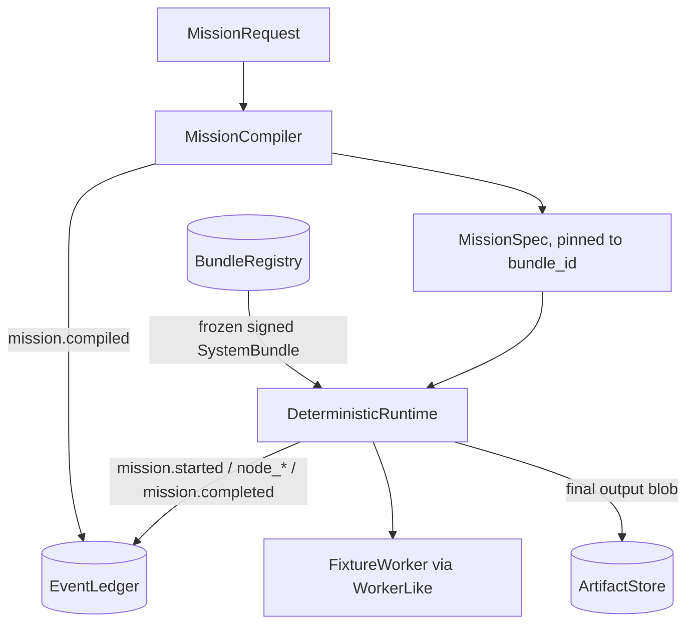
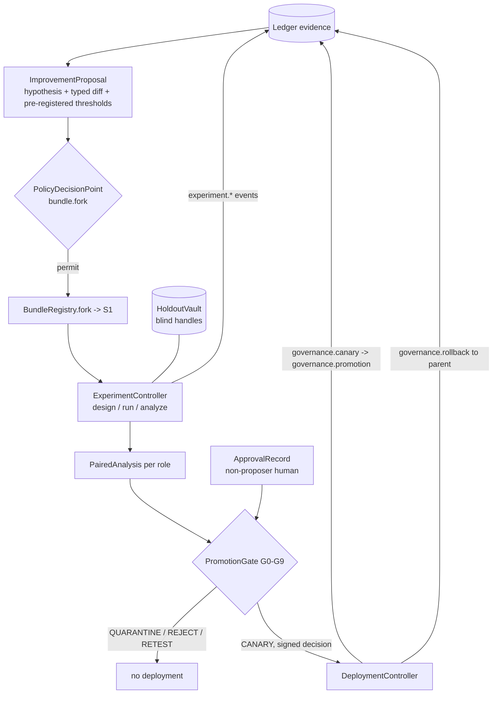

# Architecture

How the Stage-1 code maps onto the system described in `TECHNICAL_REPORT.md`. Section numbers below refer to that report.

## The five system planes (report 8.2)

The report organizes the foundry into five planes with distinct authority boundaries. Stage 1 implements a concrete slice of each:

| Plane (report 8.2) | Authority boundary | Stage-1 modules |
|---|---|---|
| 1. Human and observability | Read broad; write through authenticated commands | `foundry.cli` (`demo`, `verify`, `lineage`, `replay`); `ApprovalRecord` is the human-authorization contract. No operator UI yet: the CLI verify/lineage/replay commands are the Stage-1 observability surface. |
| 2. Governance and security | Protected root, outside autonomous modification | `foundry.policy` (fail-closed PDP, `ALLOWED_MUTATIONS`, capability issuer), `foundry.promotion` (G0-G9 gates, signed decisions), `foundry.registry.signing` (`HMACSigner`), `foundry.experiment.vault` (`HoldoutVault`) |
| 3. Mission execution | Runs one frozen bundle per mission | `foundry.compiler` (`MissionCompiler`), `foundry.runtime` (`RuntimeAdapter` protocol, `DeterministicRuntime`), `foundry.workers` (`FixtureWorker`) |
| 4. Evidence and memory | Immutable raw evidence; governed derived writes | `foundry.ledger` (`EventLedger`), `foundry.artifacts` (`ArtifactStore`), `foundry.registry` (`BundleRegistry`). Memory ships as **contracts only** (`contracts/memory.py`: `MemoryItem`, `ContextPackage`); there is no memory service yet. |
| 5. Experiment and RSI | May create candidate branches, cannot alter trusted roots | `foundry.experiment` (`ExperimentController`, paired-bootstrap analysis), `foundry.evaluation` (oracle, `EvaluationHarness`), `foundry.deployment` (`DeploymentController`) |

The boundary discipline is real in code: the experiment plane appends events but cannot edit the ledger, cannot read the vault's ground truth (only `run_blind` scores cross the boundary), and produces decisions that the deployment controller independently re-verifies (signature, gate coverage, approvals, bundle signature) before anything activates.

## The two-loop operating model (report 8.3) as implemented in the demo

`foundry.cli.run_demo` executes both loops end to end.

**Mission loop** (demo steps 1-2): a `MissionRequest` is compiled into an immutable `MissionSpec` pinned to a signed bundle; `DeterministicRuntime` executes the fixed `workflow://fixture/v1` graph (plan, execute, verify) while emitting canonical events; the mission closes without changing the active bundle. The runtime keeps no private durable state, so `resume` reconstructs progress purely from the ledger and re-delivery of a completed node emits `workflow.duplicate_suppressed` instead of re-executing.

**Improvement loop** (demo steps 3-9): evidence from completed missions motivates a typed `ImprovementProposal`; the PDP checks the mutation surface; `BundleRegistry.fork` creates candidate S1; the `ExperimentController` runs the paired experiment (control always included, protected holdout blind); the `PromotionGate` maps the evidence to one decision; a human approval (never the proposer) unlocks CANARY; the `DeploymentController` activates canary then scoped production and can roll back to the recorded parent.

## Event families actually emitted

`foundry.contracts.EventTypes` defines the full report-15.2 vocabulary as stable strings. The Stage-1 code emits this subset:

| Family | Event types emitted | Emitter |
|---|---|---|
| Mission | `mission.compiled`, `mission.started`, `mission.resumed`, `mission.completed`, `mission.cancelled` | `MissionCompiler`, `DeterministicRuntime` |
| Workflow | `workflow.node_started`, `workflow.node_completed`, `workflow.node_failed`, `workflow.duplicate_suppressed` | `DeterministicRuntime` |
| Experiment | `experiment.designed`, `experiment.randomized`, `experiment.arm_started`, `experiment.arm_completed`, `experiment.analyzed`, `experiment.leakage_detected` | `ExperimentController` |
| Evaluation | `evaluation.metric_computed` | `ExperimentController` |
| Governance | `governance.proposal_submitted`, `governance.approval_requested`, `governance.decision`, `governance.canary`, `governance.promotion`, `governance.rollback` | CLI demo flow, `DeploymentController` |

The remaining families (model, tool, memory, resource, and the unused mission/workflow types such as `mission.suspended`, `workflow.retry`, `workflow.checkpoint`) are defined in the vocabulary but not yet emitted; they belong to the model-backed runtimes, tool gateway and memory service of later stages.

## Deliberately not built yet (report 19.1 "Do not build yet")

Stage 1 intentionally omits, per the report's stage gating:

| Deferred item | Why deferred | Where it plugs in later |
|---|---|---|
| Automatic prompt mutation (GEPA/DSPy proposers) | Human-designed candidates must first demonstrate fair comparison and reliable gates (report 19.6) | `adapters/optimizers/gepa_dspy/`: a proposer emits typed `ImprovementProposal` objects; it never gains promotion authority |
| Workflow topology search (AFlow-style) | Level-3 mutation surface is empty in Stage 1 (`policy.ALLOWED_MUTATIONS`) | New allowed prefixes plus `/workflow_ref` unlocking in the PDP, only after single-component attribution is reliable |
| Graph/vector memory projections and model-assisted extraction | Provenance, quarantine and expiry now exist (`foundry.memory`, ADR-009); projections and extractors plug in behind the staged-write API | Extraction workers stage candidates through `MemoryService.stage`; vector/temporal-graph read models rebuild from the same ledger events |
| Real coding workers (OpenHands, mini-SWE-agent) | Stage-1 experiments need a known ground truth | `adapters/coding/openhands/`, `adapters/coding/mini_swe_agent/` behind `foundry.contracts.WorkerLike` |
| A2A / agent federation, meta-RSI, module marketplace, strategy-game UI | Out of scope until Stages 3-4 | Not scaffolded on purpose |

The adapter directories exist as documented seams so future integrations land behind the frozen protocols instead of inside the control plane. The first one is filled: `foundry.adapters.langgraph_runtime.LangGraphRuntime` (optional dependency group `langgraph`) schedules the fixture workflow through LangGraph while inheriting the shared `LedgerBackedRuntime` control plane, and `tests/test_runtime_conformance.py` pins its canonical event stream as byte-identical to the deterministic reference (report 9.3: a runtime swap must never change what counts as the record).
